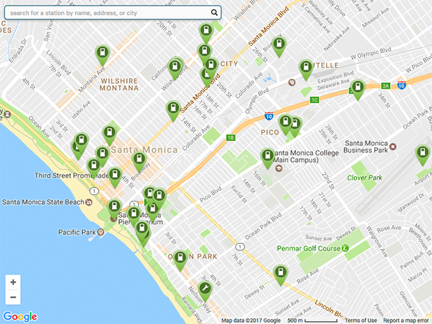
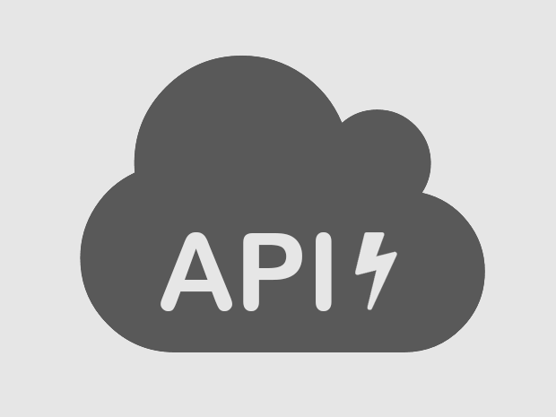

<title>PlugShare Developer Center</title>
<meta name="description" content="PlugShare developer portal. Popular topics: PlugShare embed map, permalinking, API documentation, commercial API access request">
<link rel="canonical" href="https://developer.plugshare.com/">

  <section id="map">
    
    <h2>PlugShare Map</h2>
    <a href="embed"><h3>Add a Charging Map to your Website</h3></a> 
    <a href="permalink"><h3>Permalinking</h3></a>
  </section>
  <section id="api">
    
    <h2>Charging Stations API</h2>
    <a href="docs"><h3>Documentation</h3></a> 
    <a href="access"><h3>Request Access</h3></a>
  </section>
  

    

      Questions?
    

    <a href="https://recargo.freshdesk.com/support/solutions/folders/29000052288">
      

        See our FAQ
      

    </a>
  

