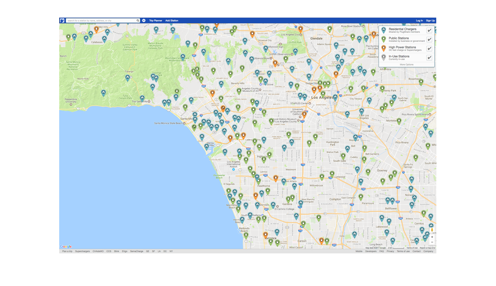

# Permalinking

You can link directly to charging locations or a map region on PlugShare's web, iOS, and Android apps. When viewed on a computer, links direct to PlugShare.com. When viewed on a mobile device, links direct to the appropriate app.
Links to charging locations can also be generated using the "Share" buttons available on PlugShare.com and in the mobile apps.

## Link directly to a location

`http://api.plugshare.com/view/location/[location_id]`

## Link to the PlugShare map zoomed to a specific region

`http://api.plugshare.com/view/map?latitude=[latitude]&longitude=[longitude]&spanLat=[latitude span]&spanLng=[longitude span]`