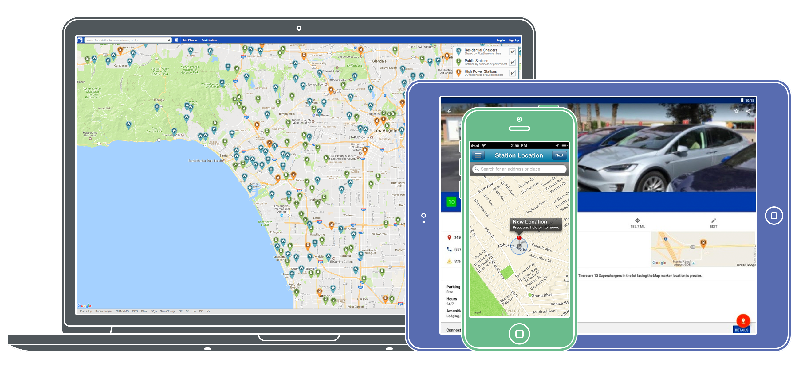

# Permalinking

You can link directly to charging locations or a map region on PlugShare's web, iOS, and Android apps. When viewed on a computer, links direct to PlugShare.com. When viewed on a mobile device, links direct to the appropriate app.
Links to charging locations can also be generated using the "Share" buttons available on PlugShare.com and in the mobile apps.

## Link directly to a location

`https://api.plugshare.com/view/location/[location_id]`

### Example

`https://api.plugshare.com/view/location/20840`

## Link to the PlugShare map zoomed to a specific region

`https://api.plugshare.com/view/map?latitude=[latitude]&longitude=[longitude]&spanLat=[latitude span]&spanLng=[longitude span]`

### Example

`https://api.plugshare.com/view/map?latitude=33.992476&longitude=-118.4721&spanLat=0.1&spanLng=0.1`

  

    Questions?
  

  

    <a href="mailto:info@plugshare.com">Contact Us</a>
  

