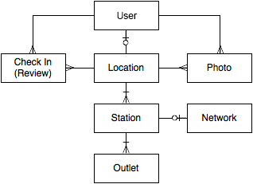

# Introduction

Welcome to the PlugShare API! You can use our REST API to access PlugShare API endpoints, which can get information on charging stations, reviews, and photos in our database. The PlugShare API is a REST API

## Using The API

Generally, you'll want to use a search method to return a list of locations. Each location will contain one or more stations, each of which may contain one or more outlets. Not all information about a location is returned from the search method; for reviews, photos, and more you'll want to request the location directly using its unique identifier.  
Here are some examples to get you started. Try out [`GET /locations/nearby`](#get-nearby-locations) and [`GET /locations/region`](#get-locations-in-region)

## Access Instructions

PlugShare uses API keys to allow access to the API. You can register a new PlugShare API key at our [developer portal](/access).

HTTPS + HTTP Basic auth is required when making API requests. After obtaining an API key/secret, the key and secret have to be specified in the request with HTTP Basic Auth, i.e. converted into an Authorization header.

URL: [https://api.plugshare.com/](https://api.plugshare.com/)

# Core Data Entities



A location or station may also have zero to many promos, and a location may also have zero to many amenities.

# Location

A driver identifiable destination where Charging Stations (Stations) are located. As a general rule if stations are within visible range of each other they are organized together into a location.

## Object Properties

> Example Response:

```json
{
  "valid_outlets": [
    {
      "connector": 1
    },
    {
      "connector": 2
    },
    {
      "connector": 3
    },
    {
      "connector": 13
    },
    {
      "connector": 4
    },
    {
      "connector": 6
    },
    {
      "connector": 5
    }
  ],
  "description": "No Public Access.",
  "opening_date": "None",
  "updated_at": "2016-12-09T10:16:23Z",
  "hours": "",
  "phone": "",
  "promos": [],
  "cost": true,
  "pwps_version": 2,
  "address": "1015 Abbot Kinney Blvd Los Angeles, CA 90291",
  "score": 10,
  "id": 20667,
  "parking_type_name": "Free",
  "icon": "https://assets.plugshare.com/icons/B.png",
  "cost_description": "",
  "reviews": [],
  "name": "PlugShare API Station",
  "url": "http://api.plugshare.com/view/location/20667",
  "created_at": "2013-11-19T22:26:33Z",
  "icon_type": "B",
  "all_promos": [
    {
      "link_url": null,
      "tag": null,
      "image_url": null,
      "name": "EZ-Charge",
      "link_action": null,
      "lat": null,
      "lng": null,
      "image_url_2x": null,
      "id": 2,
      "app_id": null
    }
  ],
  "longitude": -118.4721,
  "access": 2,
  "locale": "US",
  "under_repair": true,
  "amenities": [
    {
      "location_id": 20667,
      "type": 1
    }
  ],
  "poi_name": "Workplace Private",
  "coming_soon": null,
  "latitude": 33.992476,
  "photos": [
    {
      "user_id": 85274,
      "url": "https://photos.plugshare.com/photos/165827.jpg",
      "created_at": "2016-11-29T17:57:14Z",
      "thumbnail": "https://photos.plugshare.com/thumb/165827.png",
      "caption": "PlugShare Garage",
      "thumbnail2x": "https://photos.plugshare.com/thumb2x/165827.png",
      "order": 1,
      "id": 127483
    }
  ],
  "open247": false,
  "stations": [
    {
      "qr_enabled": true,
      "cost": 2,
      "pwps_version": 2,
      "location_id": 20840,
      "id": 37558,
      "cost_description": "$1/hour: first 4 hours. $20/hour thereafter. 50 cent minimum. Fees continue while car is connected even if not charging.",
      "pre_charge_instructions": null,
      "network": {
        "description": "GE's networked platform that allows users to manage and monitor the charging of their electric cars.",
        "url": "https://www.gewattstation.com/connect/",
        "image": "https://assets.plugshare.com/network-images/watt.png",
        "action_name": "Sign Up",
        "phone": "8554433873",
        "action_url": "https://www.gewattstation.com/connect/",
        "id": 4,
        "name": "GE WattStation"
      },
      "latitude": 33.992305,
      "available": 1,
      "outlets": [
        {
          "available": null,
          "description": null,
          "power": 0,
          "connector": 2,
          "id": 95845,
          "outlet_index": null
        }
      ],
      "hours": "",
      "promos": [],
      "manufacturer": "GE WattStation",
      "name": "PRIVATE LOCATION",
      "network_id": 4,
      "created_at": "2013-11-19T22:26:35Z",
      "longitude": -118.472993,
      "model": "",
    }
  ]
}
```

<table>
  <tr>
    <th>Property</th>
    <th>Description</th>
  </tr>
  <tr>
    <td>
      <div class="field">id</div>
      <div class="type">Number (integer)</div>
    </td>
    <td>Unique and immutable identifier.</td>
  </tr>
  <tr>
    <td>
      <div class="field">name</div>
      <div class="type">String</div>
    </td>
    <td>Descriptive name of the parking structure, business, etc.</td>
  </tr>
  <tr>
    <td>
      <div class="field">latitude</div>
      <div class="type">Number</div>
    </td>
      <td>Latitude coordinate for this location.</td>
  </tr>
  <tr>
    <td>
      <div class="field">longitude</div>
      <div class="type">Number</div> 
    </td>
      <td>Longitude coordinate for this location.</td>
  </tr>
  <tr>
    <td>
      <div class="field">description</div>
      <div class="type">String</div>
    </td>
    <td>Unicode string describing a location, can include HTML elements.</td>
  </tr>
  <tr>
    <td>
      <div class="field">stations</div>
      <div class="type">Array</div>
    </td>
    <td>Contains station objects. Each location will have at least 1 station object.</td>
  </tr>
  <tr>
    <td>
      <div class="field">reviews</div>
      <div class="type">Array</div>
    </td>
    <td>Contains review objects. Ordered from the most recent to oldest. This array can be empty.</td>
  </tr>
  <tr>
    <td>
      <div class="field">valid_outlets</div>
      <div class="type deprecated">Array</div>
    </td>
    <td>The types of outlets that are valid for this location’s locale. This is not a list of outlet types that are present.</td>
  </tr>
  <tr>
    <td>
      <div class="field">photos</div>
      <div class="type">Array</div>
    </td>
    <td>Contains photo objects. Ordered from the most recent to oldest. This array can be empty.</td>
  </tr>
  <tr>
    <td>
      <div class="field">promos</div>
      <div class="type">Array</div>
    </td>
    <td>Contains promo objects. This will only return promos at the location level. This array can be empty.</td>
  </tr>
  <tr>
    <td>
      <div class="field">all_promos</div>
      <div class="type">Array</div>
    </td>
    <td>Contains promo objects. This will return all promos at both the location level and station level. This array can be empty.</td>
  </tr>
  <tr>
    <td>
      <div class="field">score</div>
      <div class="type">Number (decimal)</div>
    </td>
    <td>The location’s PlugScore - If a location has enough data to be scored this is a decimal number with 1 significant digit from 0.0 (worst) - 10.0 (best). Score is based on recency weighted reviews and may also be affected by cost, available power, and other factors.</td>
  </tr>
  <tr>
    <td>
      <div class="field">cost</div>
      <div class="type">Boolean</div>
    </td>
    <td>If true, then there is a cost associated with this location (check cost_description). If false, then cost is unknown. This field supplements cost values at each station location. Generally cost values at stations are provided by 3rd parties, while cost values at locations are provided by PlugShare members.</td>
  </tr>
  <tr>
    <td>
      <div class="field">cost_description</div>
      <div class="type">String</div>
    </td>
    <td>A description of fees for charging and parking at this location.</td>
  </tr>
  <tr>
    <td>
      <div class="field" id="access-values">access</div>
      <div class="type">Number (integer enum)</div>
    </td>
    <td><b>1</b> = A public location.<br>
    <b>2</b> = A restricted location. Not available for general public use. Examples include workplace charging and car dealerships with charging policy restrictions.<br>
    <b>3</b> = A residential location that has been shared. Not available for public use without prior permission.</td>
  </tr>
  <tr>
    <td>
      <div class="field">url</div>
      <div class="type">String (URL)</div>
    </td>
    <td>A shareable link that redirects to this PlugShare location (platform aware: opens apps if user is on mobile, otherwise directs to web).</td>
  </tr>
  <tr>
    <td>
      <div class="field">icon</div>
      <div class="type">String (URL)</div>
    </td>
    <td>A recommended icon for displaying the location.</td>
  </tr>
  <tr>
    <td>
      <div class="field">icon_type</div>
      <div class="type">String</div>
    </td>
    <td>The stripped file name of the icon's URL path.</td>
  </tr>
  <tr>
    <td>
      <div class="field">phone</div>
      <div class="type">String</div>
    </td>
    <td>Formatting of this field is not currently guaranteed.</td>
  </tr>
  <tr>
    <td>
      <div class="field">address</div>
      <div class="type">String</div>
    </td>
    <td>Street address of the location.</td>
  </tr>
  <tr>
    <td>
      <div class="field">pwps_version</div>
      <div class="type">Number (integer)</div>
    </td>
    <td>The Pay with PlugShare version protocol required to be supported by the client to activate this station.</td>
  </tr>
  <tr>
    <td>
      <div class="field">created_at</div>
      <div class="type">String (timestamp)</div>
    </td>
    <td>ISO 8601 Format "yyyy-mm-ddThh:mm:ssZ".</td>
  </tr>
  <tr>
    <td>
      <div class="field">updated_at</div>
      <div class="type">String (timestamp)</div>
    </td>
    <td>Timestamp of the last time this location was updated. "yyyy-mm-dd hh:mm:ss" format.</td>
  </tr>
  <tr>
    <td>
      <div class="field">qr_enabled</div>
      <div class="type">Boolean</div>
    </td>
    <td>True if this station is tagged with a QR code for station identification and activation flows.</td>
  </tr>
  <tr>
    <td>
      <div class="field">poi_name</div>
      <div class="type">String</div>
    </td>
    <td>Point of interest / location type name. Selected from a list of 40+ types, including Gas Station, Park, Restaurant, etc.</td>
  </tr>
  <tr>
    <td>
      <div class="field">parking_type_name</div>
      <div class="type">String</div>
    </td>
    <td>The types of parking available. Customers Only, Free, Pay, Restricted, Unknown, '', or null.</td>
  </tr>
  <tr>
    <td>
      <div class="field">locale</div>
      <div class="type">String</div>
    </td>
    <td>This location's locale. US, UK, EU, AU, JP, WW.</td>
  </tr>
  <tr>
    <td>
      <div class="field">opening_date</div>
      <div class="type">String (date)</div>
    </td>
    <td>Date when location is anticipated to open in the future. "yyyy-mm-dd" format.</td>
  </tr>
  <tr>
    <td>
      <div class="field">hours</div>
      <div class="type">String</div>
    </td>
    <td>String for hours of availability. Commonly 24/7 or specified time frames.</td>
  </tr>
  <tr>
    <td>
      <div class="field">open247</div>
      <div class="type">Boolean</div>
    </td>
    <td>Flag if the location is open 24 hours a day, 7 days a week.</td>
  </tr>
  <tr>
    <td>
      <div class="field">coming_soon</div>
      <div class="type">Boolean</div>
    </td>
    <td>Flag if the location is not currently active and is anticipated to be coming soon.</td>
  </tr>
  <tr>
    <td>
      <div class="field">under_repair</div>
      <div class="type">Boolean</div>
    </td>
    <td>Flag if the location is currently under repair.</td>
  </tr>
  <tr>
    <td>
      <div class="field">compass_bearing</div>
      <div class="type">Number (float)</div>
    </td>
    <td>A compass bearing from the specified address or coordinate.  Note: this field will only appear for locations returned by the /locations/nearby endpoint.</td>
  </tr>
  <tr>
    <td>
      <div class="field">distance_meters</div>
      <div class="type">Number (float)</div>
    </td>
    <td>A distance in meters from the specified address or coordinate.  Note: this field will only appear for locations returned by the /locations/nearby endpoint.</td>
  </tr>
</table>

## Get Location

> Example Request:

```plaintext
GET https://api.plugshare.com/locations/38606
```

> Example Response:

```json
{
    "valid_outlets": [],
    "description": "No Public Access.",
    "opening_date": "None",
    "updated_at": "2016-12-09T10:16:23Z",
    "hours": "",
    "phone": "",
    "promos": [],
    "cost": true,
    "pwps_version": 2,
    "address": "1015 Abbot Kinney Blvd Los Angeles, CA 90291",
    "score": 10,
    "id": 38606,
    "parking_type_name": "Free",
    "icon": "https://assets.plugshare.com/icons/B.png",
    "cost_description": "",
    "reviews": [],
    "name": "PlugShare API Station",
    "url": "http://api.plugshare.com/view/location/38606",
    "created_at": "2013-11-19T22:26:33Z",
    "icon_type": "B",
    "all_promos": [],
    "longitude": -118.4721,
    "access": 2,
    "locale": "US",
    "under_repair": true,
    "amenities": [],
    "poi_name": "Workplace Private",
    "coming_soon": null,
    "latitude": 33.992476,
    "photos": [],
    "open247": false,
    "stations": []
}
```

This endpoint retrieves a location based on location id.

### HTTP Request

`GET https://api.plugshare.com/locations/{id}`

### Arguments

<table>
  <tr>
    <td>
      <div class="field">id</div>
      <div class="type required">required</div>
    </td>
    <td>Location id of target location</td>
  </tr>
</table>

<aside class="notice">
Optional location filters do not apply to this endpoint because this only returns 0 or 1 location object(s).
</aside>

### Returns

Returns a `location` object if the call succeeded.

## Get Nearby Locations

> Example Request:

```plaintext
GET https://api.plugshare.com/locations/nearby?latitude=33.992476&longitude=-118.4721&count=10
```

> Example Response:

```json
[
    {
        "valid_outlets": [],
        "description": "No Public Access.",
        "opening_date": "None",
        "updated_at": "2016-12-09T10:16:23Z",
        "hours": "",
        "phone": "",
        "promos": [],
        "cost": true,
        "pwps_version": 2,
        "address": "1015 Abbot Kinney Blvd Los Angeles, CA 90291",
        "score": 10,
        "id": 45911,
        "parking_type_name": "Free",
        "icon": "https://assets.plugshare.com/icons/B.png",
        "cost_description": "",
        "name": "PlugShare API Station",
        "url": "http://api.plugshare.com/view/location/45911",
        "created_at": "2013-11-19T22:26:33Z",
        "icon_type": "B",
        "all_promos": [],
        "longitude": -118.4721,
        "access": 2,
        "locale": "US",
        "under_repair": true,
        "amenities": [],
        "poi_name": "Workplace Private",
        "coming_soon": null,
        "latitude": 33.992476,
        "open247": false,
        "stations": []
    }
]
```

This endpoint retrieves locations near a given coordinate.

### HTTP Request

`GET https://api.plugshare.com/locations/nearby`

### Arguments

<table>
  <tr>
    <td>
      <div class="field">latitude</div>
      <div class="type required">conditional</div>
    </td>
    <td>Latitude coordinate of target search location.<br>
    <i>This endpoint requires either lat/lng coordinates or an address.</i></td>
  </tr>
  <tr>
    <td>
      <div class="field">longitude</div>
      <div class="type required">conditional</div>
    </td>
    <td>Longitude coordinate of target search location.<br>
    <i>This endpoint requires either lat/lng coordinates or an address.</i></td>
  </tr>
  <tr>
  <tr>
    <td>
      <div class="field">address</div>
      <div class="type required">conditional</div>
    </td>
    <td>Address of target search location.<br>
    <i>This endpoint requires either lat/lng coordinates or an address.</i><br>
    Will return {code:1} if address cannot be geolocated, and {code:2} if address is ambiguous. Otherwise returns list of locations.</td>
  </tr>
  <tr>
    <td>
      <div class="field">count</div>
      <div class="type">optional</div>
    </td>
    <td>Maximum count of locations to return. Count is capped at 500 regardless of specified value.<br>
    200-500 is a recommended value for most applications.</td>
  </tr>
  <tr>
    <td>
      <div class="field">radius</div>
      <div class="type">optional</div>
    </td>
    <td>Search radius in meters. Maximum 50000 meters.</td>
  </tr>
  <tr>
    <td>
      <div class="field">outlets</div>
      <div class="type">optional</div>
    </td>
    <td>The 'outlets' filter is a JSON formatted list of "outlet descriptor" objects. Each object has two optional properties, connector and power. Locations will only be returned if they have a station that contains one or more outlets that match one of these descriptors. A descriptor matches an outlet if each of the descriptor properties matches the corresponding property of the outlet. See <a href="#outlet-connector-types">Outlet Connector Types</a></td>
  </tr>
  <tr>
    <td>
      <div class="field">cost</div>
      <div class="type">optional, default is <b>true</b></div>
    </td>
    <td><b>true</b> = Returns all locations regardless of cost.<br>
    <b>false</b> = Does not return locations with a known fee (like parking or $/kw).</td>
  </tr>
  <tr>
    <td>
      <div class="field">minimal</div>
      <div class="type">optional, default 0</div>
    </td>
    <td>Accepts the value 1.  Speeds up the query by returning only core information for the location and stations.  Useful when populating a map view.</td>
  </tr>
  <tr>
    <td>
      <div class="field">access</div>
      <div class="type">optional</div>
    </td>
    <td>Filter on a comma separated list of access values. Matches if at least one access value is present.<br>
    See <a href="#access-values">Access Values</a></td>
  </tr>
  <tr>
    <td>
      <div class="field">availability</div>
      <div class="type">optional</div>
    </td>
    <td>Filter on a comma separated list of availability values. Matches if at least one availability value is present.<br>
    See <a href="#availability-values">Availability Values</a></td>
  </tr>
  <tr>
    <td>
      <div class="field">amenities</div>
      <div class="type">optional</div>
    </td>
    <td>Filter on a comma separated list of amenities. Matches if at least one listed amenity is present.<br>
    See <a href="#amenities-list">Amenity Values</a></td>
  </tr>
  <tr>
    <td>
      <div class="field">exclude_networks</div>
      <div class="type">optional</div>
    </td>
    <td>Filter on a comma separated list of network ids to exclude. Passing “exclude_networks=1” will exclude locations which exclusively have ChargePoint stations. If a location has both a ChargePoint station and a station of another network or a non-networked station it will still be eligible to be returned.<br>
    See <a href="#networks-list">Networks List</a></td>
  </tr>
  <tr>
    <td>
      <div class="field">networks</div>
      <div class="type">optional</div>
    </td>
    <td>Filter on a comma separated list of network ids to include. Matches if at least one network is present.<br>
    See <a href="#networks-list">Networks List</a></td>
  </tr>
  <tr>
    <td>
      <div class="field">score</div>
      <div class="type">optional</div>
    </td>
    <td>Filter on PlugScore. Accepts a range from 0.0 to 10.0. Will return results greater than or equal to the number provided.</td>
  </tr>
  <tr>
    <td>
      <div class="field">minimal</div>
      <div class="type">optional</div>
    </td>
    <td><b>1</b> = Return minimalized data as response is typically very large.</td>
  </tr>
</table>

<aside class="notice">
You may want to apply some filters to the search queries to return only relevant locations. Filters are added as query parameters (for GET requests) or JSON fields (for POST requests).
</aside>

### Additional Examples

`GET https://api.plugshare.com/locations/nearby?address=venice%2C%20ca&count=10&radius=1000`

`GET https://api.plugshare.com/locations/nearby?address=venice%2C%20ca&count=10&outlets=[{"connector":2},{"connector":6,"power":1}]`

`GET https://api.plugshare.com/locations/nearby?latitude=33.992476&longitude=-118.4721&count=10&cost=false`

`GET https://api.plugshare.com/locations/nearby?latitude=33.992476&longitude=-118.4721&count=10&access=1,3`

`GET https://api.plugshare.com/locations/nearby?latitude=33.992476&longitude=-118.4721&count=10&availability=3`

`GET https://api.plugshare.com/locations/nearby?latitude=33.992476&longitude=-118.4721&count=10&amenities=1,2`

`GET https://api.plugshare.com/locations/nearby?latitude=33.992476&longitude=-118.4721&count=10&exclude_networks=1`

`GET https://api.plugshare.com/locations/nearby?latitude=33.992476&longitude=-118.4721&count=10&networks=3,4`

### Returns

Returns an array of `location` objects, containing up to `count` locations

## Get Locations in Region

> Example Request:

```plaintext
GET https://api.plugshare.com/locations/region?spanLat=0.15&spanLng=0.10&latitude=33.992476&longitude=-118.4721&count=10
```

> Example Response:

```json
[
    {
        "valid_outlets": [],
        "description": "",
        "opening_date": "None",
        "updated_at": "2016-09-15T10:06:01Z",
        "hours": "",
        "phone": "",
        "promos": [],
        "cost": true,
        "pwps_version": null,
        "address": "210 Market Ave, Los Altos, CA 94022",
        "id": 40025,
        "parking_type_name": "Free",
        "icon": "https://assets.plugshare.com/icons/G.png",
        "cost_description": "Variable: $3.00/hour to $6.00/hour",
        "name": "Central Charging Station",
        "url": "http://api.plugshare.com/view/location/40025",
        "created_at": "2016-09-13T20:51:23Z",
        "icon_type": "G",
        "all_promos": [],
        "longitude": -122.105989,
        "access": 1,
        "locale": "US",
        "under_repair": false,
        "amenities": [],
        "poi_name": "Workplace Public",
        "coming_soon": null,
        "latitude": 37.396454,
        "open247": false,
        "stations": []
    }
]
```

This endpoint retrieves locations in a region based on a given coordinate with latitude and longitude spans.

### HTTP Request

`GET https://api.plugshare.com/locations/region`

### Arguments

<table>
  <tr>
    <td>
      <div class="field">spanLat</div>
      <div class="type required">required</div>
    </td>
    <td>Latitude span in degrees of target search region.</td>
  </tr>
  <tr>
    <td>
      <div class="field">spanLng</div>
      <div class="type required">required</div>
    </td>
    <td>Longitude span in degrees of target search region.</td>
  </tr>
  <tr>
    <td>
      <div class="field">latitude</div>
      <div class="type required">required</div>
    </td>
    <td>Latitude coordinate of target search location.</td>
  </tr>
  <tr>
    <td>
      <div class="field">longitude</div>
      <div class="type required">required</div>
    </td>
    <td>Longitude coordinate of target search location.</td>
  </tr>
  <tr>
    <td>
      <div class="field">count</div>
      <div class="type required">required</div>
    </td>
    <td>Maximum count of locations to return. Count is capped at 500 regardless of specified value.<br>
    200-500 is a recommended value for most applications.</td>
  </tr>
  <tr>
    <td>
      <div class="field">outlets</div>
      <div class="type">optional</div>
    </td>
    <td>The 'outlets' filter is a JSON formatted list of "outlet descriptor" objects. Each object has two optional properties, connector and power. Locations will only be returned if they have a station that contains one or more outlets that match one of these descriptors. A descriptor matches an outlet if each of the descriptor properties matches the corresponding property of the outlet. See <a href="#outlet-connector-types">Outlet Connector Types</a></td>
  </tr>
  <tr>
    <td>
      <div class="field">cost</div>
      <div class="type">optional, default is <b>true</b></div>
    </td>
    <td><b>true</b> = Returns all locations regardless of cost.<br>
    <b>false</b> = Does not return locations with a known fee (like parking or $/kw).</td>
  </tr>
  <tr>
    <td>
      <div class="field">minimal</div>
      <div class="type">optional, default 0</div>
    </td>
    <td>Accepts the value 1.  Speeds up the query by returning only core information for the location and stations.  Useful when populating a map view.</td>
  </tr>
  <tr>
    <td>
      <div class="field">access</div>
      <div class="type">optional</div>
    </td>
    <td>Filter on a comma separated list of access values. Matches if at least one access value is present.<br>
    See <a href="#access-values">Access Values</a></td>
  </tr>
  <tr>
    <td>
      <div class="field">availability</div>
      <div class="type">optional</div>
    </td>
    <td>Filter on a comma separated list of availability values. Matches if at least one availability value is present.<br>
    See <a href="#availability-values">Availability Values</a></td>
  </tr>
  <tr>
    <td>
      <div class="field">amenities</div>
      <div class="type">optional</div>
    </td>
    <td>Filter on a comma separated list of amenities. Matches if at least one listed amenity is present.<br>
    See <a href="#amenities-list">Amenity Values</a></td>
  </tr>
  <tr>
    <td>
      <div class="field">exclude_networks</div>
      <div class="type">optional</div>
    </td>
    <td>Filter on a comma separated list of network ids to exclude. Passing “exclude_networks=1” will exclude locations which exclusively have ChargePoint stations. If a location has both a ChargePoint station and a station of another network or a non-networked station it will still be eligible to be returned.<br>
    See <a href="#networks-list">Networks List</a></td>
  </tr>
  <tr>
    <td>
      <div class="field">networks</div>
      <div class="type">optional</div>
    </td>
    <td>Filter on a comma separated list of network ids to include. Matches if at least one network is present.<br>
    See <a href="#networks-list">Networks List</a></td>
  </tr>
  <tr>
    <td>
      <div class="field">score</div>
      <div class="type">optional</div>
    </td>
    <td>Filter on PlugScore. Accepts a range from 0.0 to 10.0. Will return results greater than or equal to the number provided.</td>
  </tr>
  <tr>
    <td>
      <div class="field">minimal</div>
      <div class="type">optional</div>
    </td>
    <td><b>1</b> = Return minimalized data as response is typically very large.</td>
  </tr>
</table>

<aside class="notice">
You may want to apply some filters to the search queries to return only relevant locations. Filters are added as query parameters (for GET requests) or JSON fields (for POST requests).
</aside>

### Additional Examples

`GET https://api.plugshare.com/locations/region?spanLat=0.15&spanLng=0.10&latitude=33.992476&longitude=-118.4721&count=10&outlets=[{"connector":2}]`

`GET https://api.plugshare.com/locations/region?spanLat=0.15&spanLng=0.10&latitude=33.992476&longitude=-118.4721&count=10&cost=false`

`GET https://api.plugshare.com/locations/region?spanLat=0.15&spanLng=0.10&latitude=33.992476&longitude=-118.4721&count=10&access=1,3`

`GET https://api.plugshare.com/locations/region?spanLat=0.15&spanLng=0.10&latitude=33.992476&longitude=-118.4721&count=10&availability=3`

`GET https://api.plugshare.com/locations/region?spanLat=0.15&spanLng=0.10&latitude=33.992476&longitude=-118.4721&count=10&amenities=1,2`

`GET https://api.plugshare.com/locations/region?spanLat=0.15&spanLng=0.10&latitude=33.992476&longitude=-118.4721&count=10&exclude_networks=1`

`GET https://api.plugshare.com/locations/region?spanLat=0.15&spanLng=0.10&latitude=33.992476&longitude=-118.4721&count=10&networks=3,4`

### Returns

Returns an array of `location` objects, containing up to `count` locations

## Search Locations

> Example Request:

```plaintext
GET https://api.plugshare.com/locations/search?query=venice%2C%20ca&count=10
```

> Example Response:

```json
[
  {
    "valid_outlets": [],
    "description": "Please call first.",
    "opening_date": "None",
    "updated_at": "2014-10-15T22:53:50Z",
    "hours": "",
    "phone": "3109231567",
    "promos": [],
    "cost": false,
    "pwps_version": null,
    "address": "Glencoe Ave Venice, CA 90291",
    "owner": "",
    "id": 58226,
    "parking_type_name": null,
    "icon": "https://assets.plugshare.com/icons/H.png",
    "cost_description": "",
    "name": "",
    "url": "http://api.plugshare.com/view/location/58226",
    "created_at": "2014-09-06T01:21:10Z",
    "icon_type": "H",
    "all_promos": [],
    "longitude": -118.449509,
    "access": 3,
    "locale": "US",
    "under_repair": false,
    "amenities": [],
    "poi_name": null,
    "coming_soon": null,
    "latitude": 34.000126,
    "open247": false,
    "stations": []
  }
]
```

This endpoint returns locations whose name or address contains a specified search query.

### HTTP Request

`GET https://api.plugshare.com/locations/search`

### Arguments

<table>
  <tr>
    <td>
      <div class="field">query</div>
      <div class="type required">required</div>
    </td>
    <td>The search query. Matches on name or address.</td>
  </tr>
  <tr>
    <td>
      <div class="field">count</div>
      <div class="type">optional</div>
    </td>
    <td>Maximum count of locations to return. Count is capped at 500 regardless of specified value.<br>
    200-500 is a recommended value for most applications.</td>
  </tr>
  <tr>
    <td>
      <div class="field">page</div>
      <div class="type">optional</div>
    </td>
    <td>This method supports paging. If page is specified, count must be specified as well.<br>
    This returns results based on the page index number, with 100 results showing per page.</td>
  </tr>
  <tr>
    <td>
      <div class="field">outlets</div>
      <div class="type">optional</div>
    </td>
    <td>The 'outlets' filter is a JSON formatted list of "outlet descriptor" objects. Each object has two optional properties, connector and power. Locations will only be returned if they have a station that contains one or more outlets that match one of these descriptors. A descriptor matches an outlet if each of the descriptor properties matches the corresponding property of the outlet. See <a href="#outlet-connector-types">Outlet Connector Types</a></td>
  </tr>
  <tr>
    <td>
      <div class="field">cost</div>
      <div class="type">optional, default is <b>true</b></div>
    </td>
    <td><b>true</b> = Returns all locations regardless of cost.<br>
    <b>false</b> = Does not return locations with a known fee (like parking or $/kw).</td>
  </tr>
  <tr>
    <td>
      <div class="field">minimal</div>
      <div class="type">optional, default 0</div>
    </td>
    <td>Accepts the value 1.  Speeds up the query by returning only core information for the location and stations.  Useful when populating a map view.</td>
  </tr>
  <tr>
    <td>
      <div class="field">access</div>
      <div class="type">optional</div>
    </td>
    <td>Filter on a comma separated list of access values. Matches if at least one access value is present.<br>
    See <a href="#access-values">Access Values</a></td>
  </tr>
  <tr>
    <td>
      <div class="field">exclude_networks</div>
      <div class="type">optional</div>
    </td>
    <td>Filter on a comma separated list of network ids to exclude. Passing “exclude_networks=1” will exclude locations which exclusively have ChargePoint stations. If a location has both a ChargePoint station and a station of another network or a non-networked station it will still be eligible to be returned.<br>
    See <a href="#networks-list">Networks List</a></td>
  </tr>
  <tr>
    <td>
      <div class="field">networks</div>
      <div class="type">optional</div>
    </td>
    <td>Filter on a comma separated list of network ids to include. Matches if at least one network is present.<br>
    See <a href="#networks-list">Networks List</a></td>
  </tr>
  <tr>
    <td>
      <div class="field">score</div>
      <div class="type">optional</div>
    </td>
    <td>Filter on PlugScore. Accepts a range from 0.0 to 10.0. Will return results greater than or equal to the number provided.</td>
  </tr>
</table>

<aside class="notice">
You may want to apply some filters to the search queries to return only relevant locations. Filters are added as query parameters (for GET requests) or JSON fields (for POST requests).
</aside>

### Additional Examples

`GET https://api.plugshare.com/locations/search?query=recargo`

`GET https://api.plugshare.com/locations/search?query=california&count=500&page=2`

`GET https://api.plugshare.com/locations/search?query=venice%2C%20ca&count=10&outlets=[{"connector":2},{"connector":6,"power":1}]`

`GET https://api.plugshare.com/locations/search?query=palo%20alto&count=100&networks=3,4&outlets=[{"connector":2},{"connector":6,"power":1}]`

`GET https://api.plugshare.com/locations/search?query=palo%20alto&count=100&access=1,2,3&cost=false`

### Returns

Returns an array of `location` objects, containing up to `count` locations

## Fetch Locations Along Route

> Example Request:

```plaintext
POST https://api.plugshare.com/locations/polyline?minimal=1

POST body:
```

```json
{
   "distance":9654,
   "outlets":"[{\"connector\":2},{\"connector\":6,\"power\":1}]",
   "access":"1,2,3",
   "polyline":"33.96515,-118.38001000000001,33.96537,33.992140000000006,-118.47224000000001",
   "exclude_networks":"2,19,3,1,26,34,5"
}
```

> Example Response:

```json
[
   {
      "access":1,
      "url":"http://api.plugshare.com/view/location/1553",
      "score":10.0,
      "name":"Electric St. Garage",
      "stations":[
         {
            "id":2385,
            "outlets":[
               {
                  "connector":2,
                  "id":50627,
                  "power":0
               }
            ]
         }
      ],
      "latitude":34.00208,
      "owner":{
         "first_name":"julius",
         "id":137549
      },
      "icon_type":"G",
      "id":2116,
      "longitude":-81.04077,
      "icon":"https://s3.amazonaws.com/plugshare.staging.assets/icons/G.png"
   }
]
```

This endpoint returns locations who are a certain `distance` away from the `polyline` path.

### HTTP Request

`POST https://api.plugshare.com/locations/polyline?minimal=1`

### Arguments

<table>
  <tr>
    <td>
      <div class="field">polyline</div>
      <div class="type required">required</div>
    </td>
    <td>A list of coordinates describing the route in the form of lat1,lng1,lat2,lng2...</td>
  </tr>
  <tr>
    <td>
      <div class="field">distance</div>
      <div class="type required">required</div>
    </td>
    <td>The search distance in meters around the route.</td>
  </tr>
  <tr>
    <td>
      <div class="field">count</div>
      <div class="type">optional</div>
    </td>
    <td>Maximum count of locations to return. Count is capped at 500 regardless of specified value.<br>
    200-500 is a recommended value for most applications</td>
  </tr>
  <tr>
    <td>
      <div class="field">page</div>
      <div class="type">optional</div>
    </td>
    <td>This method supports paging. If page is specified, count must be specified as well.<br>
    This returns results based on the page index number, with 100 results showing per page.</td>
  </tr>
  <tr>
    <td>
      <div class="field">outlets</div>
      <div class="type">optional</div>
    </td>
    <td>The 'outlets' filter is a JSON formatted list of "outlet descriptor" objects. Each object has two optional properties, connector and power. Locations will only be returned if they have a station that contains one or more outlets that match one of these descriptors. A descriptor matches an outlet if each of the descriptor properties matches the corresponding property of the outlet. See <a href="#outlet-connector-types">Outlet Connector Types</a></td>
  </tr>
  <tr>
    <td>
      <div class="field">cost</div>
      <div class="type">optional, default is <b>true</b></div>
    </td>
    <td><b>true</b> = Returns all locations regardless of cost.<br>
    <b>false</b> = Does not return locations with a known fee (like parking or $/kw).</td>
  </tr>
  <tr>
    <td>
      <div class="field">minimal</div>
      <div class="type">optional, default 0</div>
    </td>
    <td>Accepts the value 1.  Speeds up the query by returning only core information for the location and stations.  Useful when populating a map view.</td>
  </tr>
  <tr>
    <td>
      <div class="field">access</div>
      <div class="type">optional</div>
    </td>
    <td>Filter on a comma separated list of access values. Matches if at least one access value is present.<br>
    See <a href="#access-values">Access Values</a></td>
  </tr>
  <tr>
    <td>
      <div class="field">exclude_networks</div>
      <div class="type">optional</div>
    </td>
    <td>Filter on a comma separated list of network ids to exclude. Passing “exclude_networks=1” will exclude locations which exclusively have ChargePoint stations. If a location has both a ChargePoint station and a station of another network or a non-networked station it will still be eligible to be returned.<br>
    See <a href="#networks-list">Networks List</a></td>
  </tr>
  <tr>
    <td>
      <div class="field">networks</div>
      <div class="type">optional</div>
    </td>
    <td>Filter on a comma separated list of network ids to include. Matches if at least one network is present.<br>
    See <a href="#networks-list">Networks List</a></td>
  </tr>
  <tr>
    <td>
      <div class="field">score</div>
      <div class="type">optional</div>
    </td>
    <td>Filter on PlugScore. Accepts a range from 0.0 to 10.0. Will return results greater than or equal to the number provided.</td>
  </tr>
  <tr>
    <td>
      <div class="field">minimal</div>
      <div class="type">optional</div>
    </td>
    <td><b>1</b> = Return minimalized data as response is typically very large.</td>
  </tr>
</table>

<aside class="notice">
You may want to apply some filters to the search queries to return only relevant locations. Filters are added as query parameters (for GET requests) or JSON fields (for POST requests).
</aside>

### Additional Examples

`POST https://api.plugshare.com/locations/polyline`

### Returns

Returns an array of `location` objects, containing up to `count` locations

## Amenities List

id | amenity |   | id | amenity |   | id | amenity
-- | ------- | - | -- | ------- | - | -- | -------
1 | Lodging | | 4 | EV Parking | |  7 | WiFi
2 | Dining | | 5 | Valet Parking | | 8 | Shopping
3 | Restrooms | | 6 | Park | | 9 | Grocery 

# Station

A physical charging unit installed on the ground or wall. In EV industry terms this is also frequently referred to as an EVSE (Electric Vehicle Service Equipment). Stations can be network managed. Stations frequently support real time availability data.

## Object Properties

> Example Response:

```json
[
    {
        "qr_enabled": true,
        "cost": 2,
        "pwps_version": 2,
        "location_id": 20840,
        "id": 38416,
        "cost_description": "$1/hour: first 4 hours. $20/hour thereafter. 50 cent minimum. Fees continue while car is connected even if not charging.",
        "pre_charge_instructions": null,
        "network": "",
        "latitude": 33.992305,
        "available": 1,
        "outlets": [
          {
            "available": null,
            "description": null,
            "power": 0,
            "connector": 2,
            "id": 78351,
            "outlet_index": null
          }
        ],
        "hours": "",
        "promos": [],
        "manufacturer": "GE WattStation",
        "name": "PRIVATE LOCATION",
        "network_id": 4,
        "created_at": "2013-11-19T22:26:35Z",
        "longitude": -118.472993,
        "model": "",
    }
]
```

<table>
  <tr>
    <th>Property</th>
    <th>Description</th>
  </tr>
  <tr>
    <td>
      <div class="field">id</div>
      <div class="type">Number (integer)</div>
    </td>
    <td>Unique and immutable identifier.</td>
  </tr>
  <tr>
    <td>
      <div class="field">name</div>
      <div class="type">String</div>
    </td>
    <td>The name attribute of a station is the user-facing identifier for the station. Typically the name is found somewhere on the physical station.</td>
  </tr>
  <tr>
    <td>
      <div class="field">network</div>
      <div class="type">Object</div>
    </td>
    <td>The network that owns or directly manages this station.</td>
  </tr>
  <tr>
    <td>
      <div class="field">network_id</div>
      <div class="type">Number (integer)</div>
    </td>
    <td>Network id of the station.</td>
  </tr>
  <tr>
    <td>
      <div class="field">cost</div>
      <div class="type">Number (integer enum)</td>
    </div>
    <td><b>0</b> = Unknown<br>
    <b>1</b> = Free<br>
    <b>2</b> = Fee</div>
  </td>
  <tr>
    <td>
      <div class="field">cost_description</div>
      <div class="type">String</div>
    </td>
    <td>Describes the cost of charging at this location. Examples include $2/hr, $0.10/kWh, $8 per session.</td>
  </tr>
  <tr>
    <td>
      <div class="field">manufacturer</div>
      <div class="type">String</div>
    </td>
    <td>The manufacturer of this station.</td>
  </tr>
  <tr>
    <td>
      <div class="field">model</div>
      <div class="type">String</div>
    </td>
    <td>The hardware model type.</td>
  </tr>
  <tr>
    <td>
      <div class="field">pwps_version</div>
      <div class="type">Number (integer)</div>
    </td>
    <td>The Pay with PlugShare version protocol required to be supported by the client to activate this station.</td>
  </tr>
  <tr>
    <td>
      <div class="field">latitude</div>
      <div class="type">Number</div>
    </td>
      <td>Latitude coordinate for this station.</td>
  </tr>
  <tr>
    <td>
      <div class="field">longitude</div>
      <div class="type">Number</div> 
    </td>
      <td>Longitude coordinate for this station.</td>
  </tr>
  <tr>
    <td>
      <div class="field">outlets</div>
      <div class="type">Array</div>
    </td>
    <td>Contains outlet objects. Each station will have at least 1 outlet object.</td>
  </tr>
  <tr>
    <td>
      <div class="field">promos</div>
      <div class="type">Array</div>
    </td>
    <td>Contains promo objects. This will only return promos on the station level. This array can be empty.</td>
  </tr>
  <tr>
    <td>
      <div class="field" id="availability-values">available</div>
      <div class="type">Number (integer enum)</div>
    </td>
    <td><b>0</b> = Unknown<br>
    <b>1</b> = Available<br>
    <b>2</b> = In Use<br>
    <b>3</b> = Offline<br>
    <b>4</b> = Under Repair</td>
  </tr>
  <tr>
    <td>
      <div class="field">hours</div>
      <div class="type">String</div>
    </td>
    <td>String for hours of availability. Commonly 24/7 or specified time frames.</td>
  </tr>
  <tr>
    <td>
      <div class="field">location_id</div>
      <div class="type">Number (integer)</div>
    </td>
    <td>The id of the station's parent location.</td>
  </tr>
  <tr>
    <td>
      <div class="field">pre_charge_instructions</div>
      <div class="type">String</div>
    </td>
    <td>Optional network provided instructions to display before charging.</td>
  </tr>
  <tr>
    <td>
      <div class="field">qr_enabled</div>
      <div class="type">Boolean</div>
    </td>
    <td>True if this station is tagged with a QR code for station identification and activation flows.</td>
  </tr>
  <tr>
    <td>
      <div class="field">created_at</div>
      <div class="type">String (date)</div>
    </td>
    <td>ISO 8601 Format "yyyy-mm-ddThh:mm:ssZ".</td>
  </tr>
</table>

## Station Availability

> Example Request:

```plaintext
GET https://api.plugshare.com/stations/availability/38606
```

> Example Response:

```json
[
  {
    "plugshare_station_id": 174876,
    "available_changed_at": "2020-09-10T13:38:31.197691",
    "available": 1,
    "available_name": "AVAILABLE"
  },
  {
    "plugshare_station_id": 186690,
    "available_changed_at": "2020-09-10T13:38:28.870196",
    "available": 2,
    "available_name": "IN_USE"
  },
]
```

This endpoint retrieves all station availability data.

### HTTP Request

`GET https://api.plugshare.com/stations/availability`

### Arguments

<table>
  <tr>
    <td>
      <div class="field">changed_after</div>
      <div class="type">optional</div>
    </td>
    <td>Expects a timestamp in format `2020-12-31T00:00:00Z` If this is supplied, only stations with available updated after that moment are returned.</td>
  </tr>
</table>

<aside class="notice">
This API call requires special permissions to be used.
</aside>

### Returns

Returns an array of `station availability` objects if the call succeeded.

# Outlet

A physical vehicle-to-station connection point: either a plug or a socket. Stations can have multiple outlets. Stations can have outlets of varying types.

## Object Properties

> Example Response:

```json
[
    {
        "available": null,
        "power": 0,
        "connector": 2,
        "id": 85911,
    }
]
```

<table>
  <tr>
    <th>Property</th>
    <th>Description</th>
  </tr>
  <tr>
    <td>
      <div class="field">id</div>
      <div class="type">number (integer)</div>
    </td>
    <td>Unique and immutable identifier.</td>
  </tr>
  <tr>
    <td>
      <div class="field">connector</div>
      <div class="type">Number (integer enum)</div>
    </td>
    <td>See <a href="#outlet-connector-types">Outlet Connector Types</a></td>
  </tr>
  <tr>
    <td>
      <div class="field">power</div>
      <div class="type">Number (integer enum)</div>
    </td>
    <td>See <a href="#outlet-connector-types">Outlet Connector Types</a></td>
  </tr>
  <tr>
    <td>
      <div class="field">available</div>
      <div class="type">string</div>
    </td>
    <td>If null, outlet level availability is unknown (Note: generally, see Station availability instead).</td>
  </tr>
</table>

## Outlet Connector Types

PlugShare supports all EV charging connectors that are in active use globally.

<table class="connectors">
  <tr>
    <th>Connector ID</th>
    <th>Power Level</th>
    <th>Description</th>
    <th>Image</th>
    <th>North America</th>
    <th>UK</th>
    <th>EU</th>
    <th>JP</th>
    <th>AU</th>
    <th>WW</th>
  </tr>
  <tr>
    <td>1</td>
    <td></td>
    <td>US Wall Outlet</td>
    <td></td>
    <td>Y</td>
    <td></td>
    <td></td>
    <td>Y</td>
    <td></td>
    <td>Y</td>
  </tr>
  <tr>
    <td>2</td>
    <td></td>
    <td>J-1772</td>
    <td></td>
    <td>Y</td>
    <td>Y</td>
    <td>Y</td>
    <td>Y</td>
    <td>Y</td>
    <td>Y</td>
  </tr>
  <tr>
    <td>3</td>
    <td></td>
    <td>CHAdeMO</td>
    <td></td>
    <td>Y</td>
    <td>Y</td>
    <td>Y</td>
    <td>Y</td>
    <td>Y</td>
    <td>Y</td>
  </tr>
  <tr>
    <td>4</td>
    <td></td>
    <td>Tesla Roadster</td>
    <td></td>
    <td>Y</td>
    <td>Y</td>
    <td>Y</td>
    <td>Y</td>
    <td>Y</td>
    <td>Y</td>
  </tr>
  <tr>
    <td>5</td>
    <td></td>
    <td>NEMA 14-50</td>
    <td></td>
    <td>Y</td>
    <td></td>
    <td></td>
    <td></td>
    <td></td>
    <td>Y</td>
  </tr>
  <tr>
    <td>6</td>
    <td>0</td>
    <td>Tesla S HPWC</td>
    <td></td>
    <td>Y</td>
    <td>Y</td>
    <td>Y</td>
    <td></td>
    <td></td>
    <td>Y</td>
  </tr>
  <tr>
    <td>6</td>
    <td>1</td>
    <td>Tesla Supercharger</td>
    <td></td>
    <td>Y</td>
    <td>Y</td>
    <td>Y</td>
    <td></td>
    <td></td>
    <td>Y</td>
  </tr>
  <tr>
    <td>7</td>
    <td></td>
    <td>Type 2 (Mennekes)</td>
    <td></td>
    <td></td>
    <td>Y</td>
    <td>Y</td>
    <td></td>
    <td>Y</td>
    <td>Y</td>
  </tr>
  <tr>
    <td>8</td>
    <td></td>
    <td>Type 3</td>
    <td></td>
    <td></td>
    <td>Y</td>
    <td>Y</td>
    <td></td>
    <td></td>
    <td>Y</td>
  </tr>
  <tr>
    <td>9</td>
    <td></td>
    <td>BS1363</td>
    <td></td>
    <td></td>
    <td>Y</td>
    <td></td>
    <td></td>
    <td></td>
    <td>Y</td>
  </tr>
  <tr>
    <td>10</td>
    <td></td>
    <td>Europlug</td>
    <td></td>
    <td></td>
    <td></td>
    <td>Y</td>
    <td></td>
    <td></td>
    <td>Y</td>
  </tr>
  <tr>
    <td>11</td>
    <td></td>
    <td>UK Commando</td>
    <td></td>
    <td></td>
    <td>Y</td>
    <td></td>
    <td></td>
    <td></td>
    <td>Y</td>
  </tr>
  <tr>
    <td>12</td>
    <td></td>
    <td>AS3112</td>
    <td></td>
    <td></td>
    <td></td>
    <td></td>
    <td></td>
    <td>Y</td>
    <td>Y</td>
  </tr>
  <tr>
    <td>13</td>
    <td></td>
    <td>SAE Combo DC CCS</td>
    <td></td>
    <td>Y</td>
    <td></td>
    <td>Y</td>
    <td></td>
    <td>Y</td>
    <td>Y</td>
  </tr>
  <tr>
    <td>14</td>
    <td></td>
    <td>Three Phase (AU)</td>
    <td></td>
    <td></td>
    <td></td>
    <td></td>
    <td></td>
    <td>Y</td>
    <td>Y</td>
  </tr>
  <tr>
    <td>14</td>
    <td></td>
    <td>Three Phase (EU)<br>(currently same ID)</td>
    <td></td>
    <td></td>
    <td></td>
    <td>Y</td>
    <td></td>
    <td></td>
    <td>Y</td>
  </tr>
  <tr>
    <td>15</td>
    <td></td>
    <td>Caravan Mains Socket</td>
    <td></td>
    <td></td>
    <td>Y</td>
    <td>Y</td>
    <td></td>
    <td>Y</td>
    <td>Y</td>
  </tr>
  <tr>
    <td>16</td>
    <td></td>
    <td>China BG/T</td>
    <td></td>
    <td></td>
    <td></td>
    <td></td>
    <td></td>
    <td></td>
    <td>Y</td>
  </tr>
  <tr>
    <td>17</td>
    <td></td>
    <td>China BG/T 2</td>
    <td></td>
    <td></td>
    <td></td>
    <td></td>
    <td></td>
    <td></td>
    <td>Y</td>
  </tr>
</table>

# Network

A company that operates stations and provides subscription services or access control services for those stations.

## Object Properties

> Example Response:

```json
{
    "description": "GE's networked platform that allows users to manage and monitor the charging of their electric cars.",
    "url": "https://www.gewattstation.com/connect/",
    "image": "https://assets.plugshare.com/network-images/watt.png",
    "action_name": "Sign Up",
    "phone": "8554433873",
    "action_url": "https://www.gewattstation.com/connect/",
    "id": 4,
    "name": "GE WattStation"
}
```

<table>
  <tr>
    <th>Property</th>
    <th>Description</th>
  </tr>
  <tr>
    <td>
      <div class="field">id</div>
      <div class="type">number (integer)</div>
    </td>
    <td>Unique and immutable identifier.</td>
  </tr>
  <tr>
    <td>
      <div class="field">name</div>
      <div class="type">string</div>
    </td>
    <td>The driver-friendly name for the Network’s Brand such as “SemaCharge”.</td>
  </tr>
  <tr>
    <td>
      <div class="field">description</div>
      <div class="type">string</div>
    </td>
    <td>A short marketing summary of the Network’s service offerings.</td>
  </tr>
  <tr>
    <td>
      <div class="field">action_name</div>
      <div class="type">string</div>
    </td>
    <td>A description of the URL destination. Examples include “Sign Up” or “Learn More”.</td>
  </tr>
  <tr>
    <td>
      <div class="field">action_url</div>
      <div class="type">string (URL)</div>
    </td>
    <td>A URL provided by a network that usually includes a call to action or contact information.</td>
  </tr>
  <tr>
    <td>
      <div class="field">url</div>
      <div class="type">string (URL)</div>
    </td>
    <td>A URL that generally links to a network's home page.</td>
  </tr>
  <tr>
    <td>
      <div class="field">phone</div>
      <div class="type">string</div>
    </td>
    <td>Phone number for customer service or activation by phone requests.</td>
  </tr>
  <tr>
    <td>
      <div class="field">image</div>
      <div class="type">string (URL)</div>
    </td>
    <td>If available, an approved logo for the Network.</td>
  </tr>
</table>

## Networks List

id | network |   | id | network |   | id | network |   | id | network |
-- | ------- | - | -- | ------- | - | -- | ------- | - | -- | ------- |
1 | ChargePoint  | | 15 | Endesa  | | 36 | ChargeNet  | | 54 | Electrify Canada
2 | Blink  | | 19 | EVgo  | | 37 | Recargo  | | 55 | IVY
3 | Semaconnect  | | 22 | Lastestasjoner  | | 41 | KSI
4 | GE WattStation  | | 23 | EnelDrive  | | 45 | POLAR
5 | Sun Country  | |  25 | Volta  | | 46 | EVConnect
6 | Circuit Electrique  | | 26 | Greenlots | | 47 | Electrify America
7 | FLO | | 29 | OpConnect | | 48 | Chargefox
8 | Tesla Supercharger | | 30 | Shorepower | | 49 | BC Hydro EV
9 | EVCS | | 33 | CarCharging | | 50 | Irvine Company
13 | Innogy | | 34 | JNSH | | 51 | Ionity
14 | Oplaadpalen | | 35 | Tesla Destination | | 52 | Fastned


# Photo

A location photo contributed by the PlugShare community.

## Object Properties

Note that JSON objects described here will be enclosed within the
location object.

> Example Response:

```json
[
    {
        "user_id": 75733,
        "url": "https://photos.plugshare.com/photos/165827.jpg",
        "created_at": "2016-11-29T17:57:14Z",
        "thumbnail": "https://photos.plugshare.com/thumb/165827.png",
        "caption": "PlugShare Garage",
        "thumbnail2x": "https://photos.plugshare.com/thumb2x/165827.png",
        "order": 1,
        "id": 192372
    }
]
```

<table>
  <tr>
    <th>Property</th>
    <th>Description</th>
  </tr>
  <tr>
    <td>
      <div class="field">id</div>
      <div class="type">Number (integer)</div>
    </td>
    <td>Unique and immutable identifier.</td>
  </tr>
  <tr>
    <td>
      <div class="field">url</div>
      <div class="type">String (URL)</div>
    </td>
    <td>The URL to the full size photo.</td>
  </tr>
  <tr>
    <td>
      <div class="field">thumbnail</div>
      <div class="type">String (URL)</div>
    </td>
    <td>If available, link to a smaller version of the photo(1).</td>
  </tr>
  <tr>
    <td>
      <div class="field">thumbnail2x</div>
      <div class="type">String (URL)</div>
    </td>
    <td>If available, link to a smaller version of the photo(1), rendered at 2x the standard thumbnail size.</td>
  </tr>
  <tr>
    <td>
      <div class="field">caption</div>
      <div class="type">String</div>
    </td>
    <td>User provided caption of the photo.</td>
  </tr>
  <tr>
    <td>
      <div class="field">order</div>
      <div class="type">Number (integer)</div>
    </td>
    <td>Arrangement order of pinned photos at this location.</td>
  </tr>
  <tr>
    <td>
      <div class="field">user_id</div>
      <div class="type">Number (integer)</div>
    </td>
    <td>The id of the user who uploaded this photo.</td>
  </tr>
  <tr>
    <td>
      <div class="field">created_at</div>
      <div class="type">String (timestamp)</div>
    </td>
    <td>ISO 8601 Format “yyyy-mm-ddThh:mm:ssZ”.</td>
  </tr>
</table>

(1) Service side processing of additional formats and dimensions are available as needed.

## Get Network Photos

Return a list of JSON objects representing photos at the network's locations
ordered by creation time.  Each object represents data about a photo.  Note
that JSON objects described here are NOT the same as the objects returned
within the location object, described above.

> Example Request:


```plaintext
GET https://api.plugshare.com/network/999/photos?start=2018-08-01T21:59:46Z&count=32
```

> Example Response:


```json
{
    "created_at": "2018-08-01T23:00:00Z",
    "url": "https://s3.amazonaws.com/photos/1.png",
    "caption": "Had a great charge here",
}
```

### HTTP Request
`GET https://api.plugshare.com/network/{id}/photos`

This functionality is only available by arrangement.  It returns photos associated with
locations which contain the given network's stations.  The request must be issued with
special authentication not described here.

### Arguments

<table>
  <tr>
    <td>
      <div class="field">id</div>
      <div class="type required">required</div>
    </td>
    <td>ID of network whose photos should be returned</td>
  </tr>
  <tr>
    <td>
      <div class="field">start</div>
      <div class="type required">required</div>
    </td>
    <td>A string representing a datetime in the format 2018-08-01T21:59:46Z.  Returns photos
        created after this time.
    </td>
  </tr>
  <tr>
    <td>
      <div class="field">end</div>
      <div class="type">optional</div>
    </td>
    <td>A string representing a datetime in the format 2018-08-01T21:59:46Z.  Returns photos
        created on or before this time.
    </td>
  </tr>
  <tr>
    <td>
      <div class="field">count</div>
      <div class="type">optional</div>
    </td>
    <td>An int representing the number of results to return.  Default 500, max 500.</td>
  </tr>
</table>

### Returns
A list of JSON objects.  Each object is a simplified Photo object.


### Paging
Make a query with a start time.  The response is a list of JSON objects representing photos,
sorted in order of creation time.  If there are `count` results or fewer, issue another query
where start is the created_at of the last item in the results.

# Review (Check-In)

Check-Ins include:

* Tips for other drivers
* Reports of equipment problems
* Notification of time windows when a driver is going to be charging. This is helpful even when real-time status is available because it helps identify when a station is likely to become available.

## Object Properties

> Example Response:

```json
[
    {
        "comment": "",
        "rating": 1,
        "connector_type": 2,
        "volts": null,
        "created_at": "2014-08-11T23:54:42Z",
        "finished": "2014-08-12T00:53:22Z",
        "waiting": false,
        "user": "",
        "amps": null,
        "vehicle_type": 4,
        "vehicle_name": "Nissan LEAF 2018",
        "vehicle_default_img": "https://assets.plugshare.com/vehicles/2018_LEAF_WHITE.jpg",
        "id": 152385
    }
]
```

<table>
  <tr>
    <th>Property</th>
    <th>Description</th>
  </tr>
  <tr>
    <td>
      <div class="field">id</div>
      <div class="type">Number (integer)</div>
    </td>
    <td>Unique and immutable identifier.</td>
  </tr>
  <tr>
    <td>
      <div class="field">rating</div>
      <div class="type">Number (integer)</div>
    </td>
    <td><b>1</b> = Positive / Success<br>
    <b>0</b> = Neutral / Tips etc.<br>
    -<b>1</b> = Trouble charging or other problem</td>
  </tr>
  <tr>
    <td>
      <div class="field">comment</div>
      <div class="type">String</div>
    </td>
    <td>The user's review.</td>
  </tr>
  <tr>
    <td>
      <div class="field">volts</div>
      <div class="type">Number (integer)</div>
    </td>
    <td>User submitted data of maximum volts if recorded during this visit, else NULL. Note: depending on vehicle capabilities or limitations, this may be lower than the station’s maximum capabilities.</td>
  </tr>
  <tr>
    <td>
      <div class="field">amps</div>
      <div class="type">Number (integer)</div>
    </td>
    <td>User submitted data of maximum amps if recorded during this visit, else NULL. Note: depending on vehicle capabilities or limitations, this may be lower than the station’s maximum capabilities.</td>
  </tr>
  <tr>
    <td>
      <div class="field">finished</div>
      <div class="type">String (timestamp)</div>
    </td>
    <td>The date the user plans to leave (or left) the location.</td>
  </tr>
  <tr>
    <td>
      <div class="field">user</div>
      <div class="type">Object (User)</div>
    </td>
    <td>User object including in depth information about the user who submitted this review (check-in).</td>
  </tr>
  <tr>
    <td>
      <div class="field">problem</div>
      <div class="type">Number (integer)</div>
    </td>
    <td>Integer enum value corresponding to the problem_description property.</td>
  </tr>
  <tr>
    <td>
      <div class="field">problem_description</div>
      <div class="type">String</div>
    </td>
    <td>
      <b>1</b> = "Broken hardware"<br>
      <b>2</b> = "In use"<br>
      <b>3</b> = "Blocked by vehicle"<br>
      <b>4</b> = "Could not activate"<br>
      <b>5</b> = "Permanently closed"<br>
    </td>
  </tr>
  <tr>
    <td>
      <div class="field">waiting</div>
      <div class="type">Boolean</div>
    </td>
    <td>Indicates whether the user is waiting to charge.</td>
  </tr>

  <tr>
    <td>
      <div class="field">created_at</div>
      <div class="type">String (timestamp)</div>
    </td>
    <td>When the Check-In was submitted.</td>
  </tr>
</table>

## Get Network Checkins

Return a list of JSON objects representing checkins at the network's locations,
ordered by creation time.  Each object represents a checkin.  Note that JSON objects
described here are NOT the same as the objects returned within the location object,
described above.

> Example Request:


```plaintext
GET https://api.plugshare.com/network/999/checkins?start=2018-08-01T21:59:46Z&count=32
```

> Example Response:

```json
{
    "created_at": "2018-08-01T23:00:00Z",
    "rating": 1,
    "comment": "Easy and fast",
    "station_ids": ["75e8130c-27b6-4d9f-9918-b139dcc4f81e", "88b9c729-9209-4059-a895-d4b072b8b281"],
    "vehicle_info": "Chevrolet Bolt EV",
    "problem_description": "Could not activate",
}
```

### HTTP Request
`GET https://api.plugshare.com/network/{id}/checkins`

This functionality is only available by arrangement.  It returns checkins associated with
locations which contain the given network's stations.  The request must be issued with
special authentication not described here.


### Arguments

<table>
  <tr>
    <td>
      <div class="field">id</div>
      <div class="type required">required</div>
    </td>
    <td>ID of network whose checkins should be returned</td>
  </tr>
  <tr>
    <td>
      <div class="field">start</div>
      <div class="type required">required</div>
    </td>
    <td>A string representing a datetime in the format 2018-08-01T21:59:46Z. Returns checkins
        created after this time.
    </td>
  </tr>
  <tr>
    <td>
      <div class="field">end</div>
      <div class="type">optional</div>
    </td>
    <td>A string representing a datetime in the format 2018-08-01T21:59:46Z. Returns checkins
        created on or before this time.
    </td>
  </tr>
  <tr>
    <td>
      <div class="field">count</div>
      <div class="type">optional</div>
    </td>
    <td>An int representing the number of results to return. Default 500, max 500.</td>
  </tr>
</table>

### Returns
A list of JSON objects.  Each object is a simplified Review object.  The `stations`
attribute lists the network's identifiers for the stations at that location.  The `rating`
attribute can have the value -1, 0, or 1 indicating a negative, neutral, or positive checkin
respectively. The `vehicle_info` attribute is a string describing the user's vehicle e.g. 
"Chevrolet Bolt EV". The `problem_description` attribute is a string describing any issues 
the user encountered e.g. "Could not activate".

### Paging
Make a query with a start time.  The response is a list of JSON objects representing checkins,
sorted in order of creation time.  If there are `count` results or fewer, issue another query
where start is the created_at of the last item in the results.


# User

A PlugShare user who may be owner of reviews, check-ins, or private locations.

## Object Properties

> Example Response:

```json
{
    "allow_notifications": true,
    "first_name": "Steven",
    "notify_nearby_radius": 10000,
    "hide_address": true,
    "vehicle_description": "",
    "created_at": "2010-03-10T22:08:56Z",
    "vehicle_color": 9,
    "phone": "",
    "photos": [
        {
            "user_id": 253,
            "url": "https://photos.plugshare.com/photos/41329.jpg",
            "created_at": "2013-12-30T07:01:35Z",
            "thumbnail": "https://photos.plugshare.com/thumb/41329.png",
            "caption": "",
            "thumbnail2x": "https://photos.plugshare.com/thumb2x/41329.png",
            "order": 0,
            "id": 38376
        }
    ],
    "last_login": "2017-03-13T23:02:56Z",
    "vehicle_subtype": 5,
    "about": "",
    "vehicle_type": 52,
    "id": 3590,
    "notify_nearby": 1
}


```

<table>
  <tr>
    <th>Property</th>
    <th>Description</th>
  </tr>
  <tr>
    <td>
      <div class="field">id</div>
      <div class="type">Number (integer)</div>
    </td>
    <td>Unique and immutable identifier.</td>
  </tr>
  <tr>
    <td>
      <div class="field">first_name</div>
      <div class="type">String</div>
    </td>
    <td>User's public facing username.</td>
  </tr>
  <tr>
    <td>
      <div class="field">phone</div>
      <div class="type">String</div>
    </td>
    <td>Formatting of this field is not currently guaranteed.</td>
  </tr>
  <tr>
    <td>
      <div class="field">about</div>
      <div class="type">String</div>
    </td>
    <td>User input, public-facing about me section.</td>
  </tr>
  <tr>
    <td>
      <div class="field">allow_notifications</div>
      <div class="type">Boolean</div>
    </td>
    <td>Flag if user allows notifications.</td>
  </tr>
  <tr>
    <td>
      <div class="field">notify_nearby</div>
      <div class="type">Number (integer enum)</div>
    </td>
    <td><b>0</b> = None.<br>
    <b>1</b> = Nearby All<br>
    <b>2</b> = Nearby Private<br>
    <b>3</b> = Nearby Public</td>
  </tr>
  <tr>
    <td>
      <div class="field">notify_nearby_radius</div>
      <div class="type">Number (integer)</div>
    </td>
    <td>User's set notify if charger within nearby radius. Possible values: 1000, 1600, 5000, 8000, 10000, 16000.</td>
  </tr>
  <tr>
    <td>
      <div class="field">vehicle_type</div>
      <div class="type">Number (integer enum)</div>
    </td>
    <td>Number indicating user's selection of one of many preset vehicle types.</td>
  </tr>
  <tr>
    <td>
      <div class="field">vehicle_subtype</div>
      <div class="type">Number (integer enum)</div>
    </td>
    <td>Number indicating user's selection of one of many preset vehicle subtypes.</td>
  </tr>
  <tr>
    <td>
      <div class="field">vehicle_color</div>
      <div class="type">Number (integer enum)</div>
    </td>
    <td>Number indicating user's selection of one of many preset vehicle colors.</td>
  </tr>
  <tr>
    <td>
      <div class="field">vehicle_description</div>
      <div class="type">String</div>
    </td>
    <td>User input, self describe their own vehicle.</td>
  </tr>
  <tr>
    <td>
      <div class="field">hide_address</div>
      <div class="type">Boolean</div>
    </td>
    <td>Flag if user opted to hide personal address information.</td>
  </tr>
  <tr>
    <td>
      <div class="field">last_login</div>
      <div class="type">String (timestamp)</div>
    </td>
    <td>ISO 8601 Format “yyyy-mm-ddThh:mm:ssZ”.</td>
  </tr>
  <tr>
    <td>
      <div class="field">created_at</div>
      <div class="type">String (timestamp)</div>
    </td>
    <td>ISO 8601 Format “yyyy-mm-ddThh:mm:ssZ”.</td>
  </tr>
</table>

<br><br><br><br><br><br><br><br><br><br>
